**English** | [简体中文](./README.zh-CN.md)

# Lumo

An open-source AI **virtual companion for kids** — a friendly on-screen character
who chats, teaches, and plays. Lumo helps children explore **no-code programming,
music, data, languages, games, and drawing** through natural conversation.

- **Bring your own model** — configure any OpenAI- or Anthropic-compatible
  provider in the app. Your API key stays **on the device** and talks directly to
  your provider. No Lumo backend, no relay server, no account.
- **Runs standalone** — the AI agent runs on-device inside an embedded Node.js
  runtime (`nodejs-mobile`). No login, no registration, no cloud dependency.
- **Voice built in** — on-device speech recognition (sherpa-onnx) and online
  text-to-speech.
- **Android & iOS** — built with React Native.

> Lumo grew out of an internal project and was rebuilt as a focused,
> self-contained learning companion. The "pet" character is just the face — the
> heart is a capable tutor and playmate.

## See it in action

It started with a question from my daughter: *"Dad, why can't I see her? What
does she look like? Can she come out and play with me?"* Lumo is the answer —
a companion a child can see, poke, talk to, and invent games with.

### A character that's actually there

Blinks, emotes, and reacts when poked. Swap the model, the voice, and the scene.

| Touch & react | Different character, voice & scene |
| --- | --- |
| 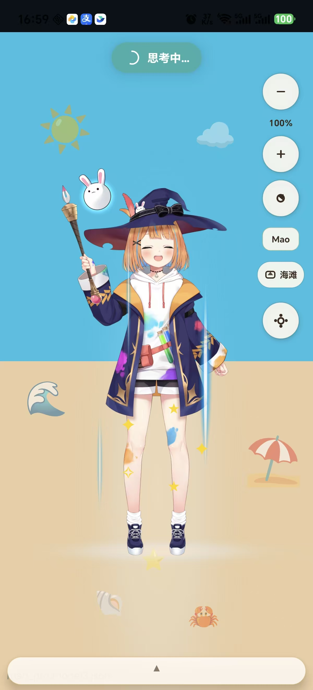 | 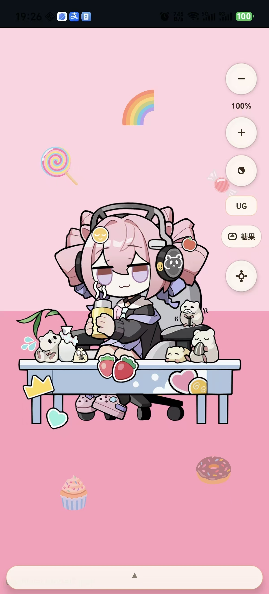 |

### Talk to it like a phone call

Press to speak, interrupt any time. Voice is the main interface — the child asks
for a game or a picture out loud, and the agent builds it while they watch.

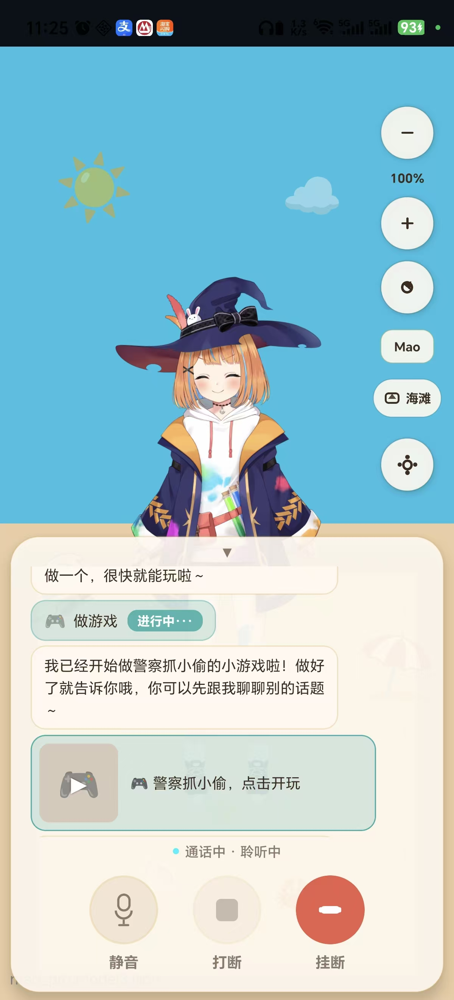

### Games the child invents

These weren't shipped with the app. The child described them out loud and the
agent generated them on the spot — then rebuilt them on "change it a bit."

| "Cops and robbers" | "Kitten sokoban" |
| --- | --- |
| 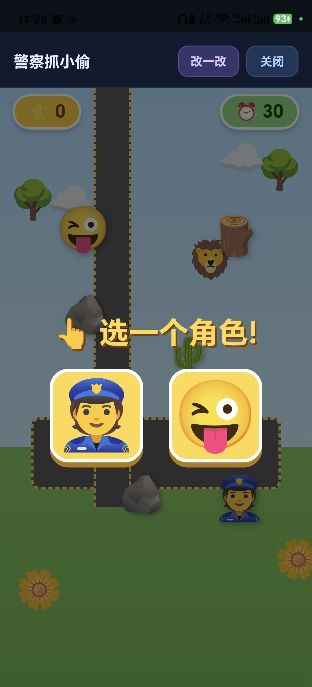 | 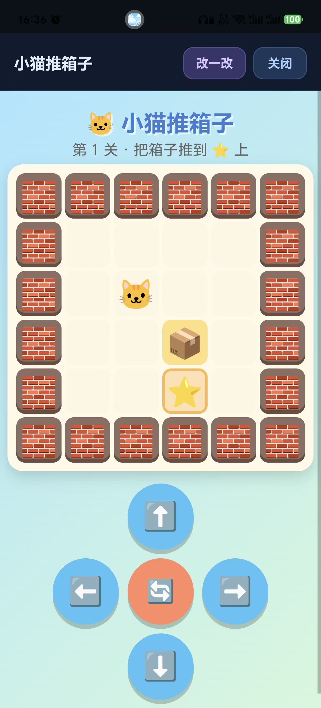 |

### Learning, generated the same way

Reading, pinyin, and arithmetic come out of the same dynamic-content pipeline —
so practice arrives mid-conversation instead of as a separate "lesson" screen.

| Pinyin & characters | Math | Drawing on request |
| --- | --- | --- |
| 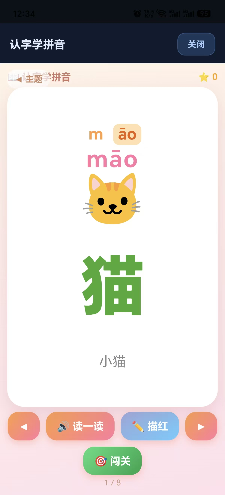 |  | 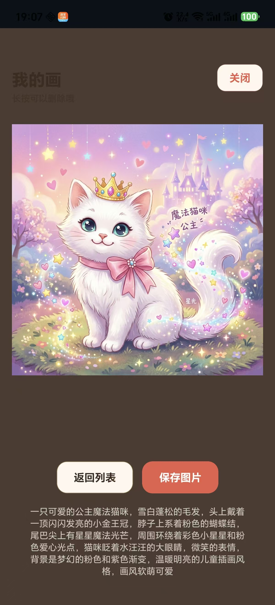 |

Every drawing comes back with a short story about it, and lands in a local
gallery. Prompts are wrapped child-safe in the tool layer, not in a system prompt.

### It remembers who it's talking to

Name, age, likes, dislikes, personality — stored on-device, injected into the
conversation, and erasable at any time. Drawings, games, and chat history each
have their own delete path.

| Personal memory | Records & preferences |
| --- | --- |
| 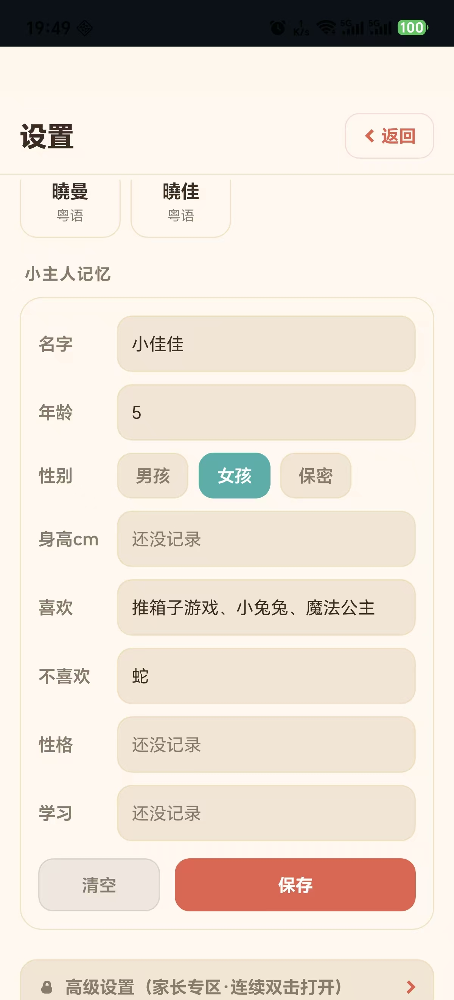 | 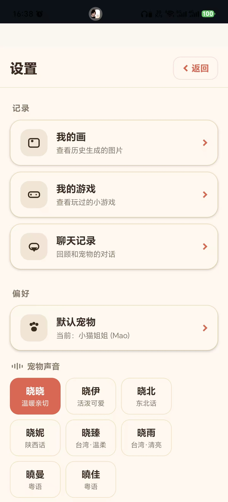 |

### Parents own the model config

Chat model and image model are configured separately — pick the protocol
(OpenAI / Anthropic for chat, OpenAI / Gemini for images), point it at any base
URL, use your own key. Point chat at a local model if you want zero egress. The
whole panel sits behind a double-tap parent gate so a curious kid can't wander
into it.

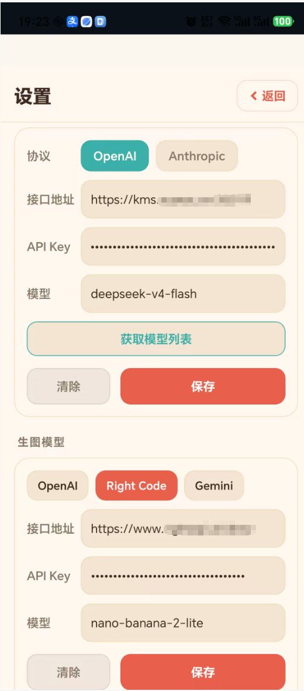

## How it works

```
┌─────────────────────────────┐
│  React Native app (UI)      │
│  ├─ Live2D character         │
│  ├─ Voice (ASR on-device)    │
│  └─ Settings: model provider │
└──────────────┬──────────────┘
               │  RN ⇄ Node bridge
┌──────────────┴──────────────┐
│  Embedded Node.js runtime    │
│  └─ AI agent  ──────────────►│  your OpenAI / Anthropic endpoint
└─────────────────────────────┘
```

The app ships an AI agent that runs **inside the device**. When you set a model
provider in Settings, the agent streams directly to that endpoint using your key.
Nothing routes through a Lumo server.

## Design philosophy

Lumo is built around one belief: a young child learns best by **talking to a
character they like**, not by tapping through menus. Everything below serves that
goal.

- **Voice-first, hands-optional.** A 3–8 year old may not read fluently. The
  primary loop is *listen → understand → speak → react*, so a child can hold a
  real conversation without touching the screen.
- **The device is the runtime.** The agent lives inside the app, not in a cloud
  service you have to trust. Your API key and conversation stay on the phone and
  talk **directly** to the model provider you chose.
- **The character is an interface, not decoration.** Emotion, motion, and lip-sync
  are driven by the conversation state, so the child reads *feeling* and *turn-taking*
  the way they would with a person.
- **Safety is enforced in code, not in prompts.** Child-safe prompt wrapping and
  hard confirmation gates for sensitive tools (like drawing) live in the tool
  layer, so they can't be talked around by a clever model or a curious kid.

## Key technologies

This section is the honest, code-level tour. Where a subsystem is a deliberate
simplification (e.g. text-level echo suppression instead of audio AEC), it says so.

### On-device speech recognition (ASR)

Speech recognition runs **fully on the device** — no audio ever leaves the phone
for transcription.

- **Engine:** [sherpa-onnx](https://github.com/k2-fsa/sherpa-onnx) **streaming
  zipformer**, bilingual **Chinese + English**, int8-quantized for mobile, paired
  with a **Silero VAD** for voice-activity detection.
- **Streaming, not batch:** partial hypotheses are emitted as the child speaks, so
  barge-in and UI feedback can react mid-utterance.
- **Serialized lifecycle:** a single native recognizer (`NativeModules.SherpaAsr`)
  is shared through a singleton that serializes `start`/`stop`, avoiding the native
  crashes you get from concurrent session churn.
- **VAD is a separate signal** from ASR text, so silence detection and endpointing
  don't depend on decoder output.

### Voice barge-in (interrupt while the character is talking)

Kids interrupt. Lumo treats that as a feature, using a **two-stage arm-then-fire**
gate so a stray cough doesn't cut the character off, but a real "wait, stop!" does.

- **Arm:** while TTS is playing, the child's incoming transcript must reach
  `BARGE_IN_MIN_CHARS_WHILE_SPEAKING` (3 chars) **and** clear a mic-energy floor
  (`BARGE_IN_MIN_MIC_LEVEL` = 0.04) to arm an interrupt.
- **Fire:** the intent must persist for `BARGE_IN_CONFIRM_MS` (250 ms) before the
  character actually stops — this rejects transient blips.
- **Cooldown:** after an interrupt, `INTERRUPT_COOLDOWN_MS` (700 ms) prevents
  immediate re-triggering.

### Echo & self-hearing suppression

The character speaks through the same speaker the mic can hear. Rather than ship a
heavy audio **AEC (acoustic echo cancellation)** DSP path, Lumo uses a lighter,
**text-level** strategy that's a good fit for a turn-taking companion:

- **Half-duplex bias** — the pipeline avoids acting on input that looks like the
  character hearing itself.
- **Text-level echo detection** (`echoTextFilter`) compares fresh transcripts against
  what the character just said using several similarity measures — substring &
  collapsed-form match, bigram **Jaccard** similarity, coverage ratio, subsequence
  and **LCS** checks, and a repetition-collapse ratio. If a transcript looks like the
  TTS output bleeding back in, it's dropped.
- `ponytail:` this is intentionally **not** real audio AEC. Trade-off: near-zero CPU
  and no native DSP dependency, at the cost of not handling true simultaneous
  double-talk. Full-duplex AEC is a future upgrade path if the product needs it.

### Noise & garbage filtering

Streaming ASR on a noisy playground produces junk. Before a transcript ever reaches
the agent, it passes a **7-stage cascade** (`asrGarbageFilter`), tuned to prefer
false-negatives (let a real phrase through) over false-positives (never eat a child's
actual words):

1. short-but-valid whitelist, 2. single-filler rejection, 3. a garbage-phrase
blacklist, 4. repeated-character spam (≥85% one char), 5. filler-only utterances,
6. low Han-character ratio (<0.3), 7. stacked-filler regex.

### Lip-sync

Mouth movement is **deterministic and time-driven**, not phoneme- or audio-driven —
which keeps it perfectly smooth and cheap while TTS plays.

- `computeMouthOpen(t)` sums a **3.5 Hz** primary and a **7.0 Hz** secondary sinusoid
  (×0.4), half-rectifies and normalizes them, then applies a small gain.
- `smoothMouthValue` runs an **EMA** (α = 0.5) so the jaw eases between frames instead
  of snapping.
- `ponytail:` deliberately not viseme-accurate. It reads as "talking" to a child and
  costs nothing; true phoneme-driven lip-sync is a future upgrade.

### Motion, expression & emotion

The character's body language is a direct read-out of the conversation.

- **State → expression policy:** `expressionForState` maps the agent's nine runtime
  states (idle, listening, thinking, speaking, …) to an `{ emotion, motionGroup }`
  pair. The renderer (`PetCoreRenderer`) resolves an emotion name to a model-specific
  expression index and plays a matching Live2D motion group.
- **Emotion tags from the model:** the LLM can emit inline `[joy]` / `[curious]`
  style tags. `emotion-tag-parser` extracts them (`\[([a-zA-Z0-9_一-龥]+)\]`) to drive
  expression, then **strips them out before TTS** so the child never hears the tag
  spoken aloud.

### Memory

Memory is **local to the device**. The mobile runtime persists sessions and
short-term memory to an on-device **SQLite** database (`node:sqlite` on the Node
runtime side, `op-sqlite` on the RN side) via `local-session-memory`:

- **Tables:** `sessions`, `messages`, `local_memories` (per-pet `key → value`), and
  `tool_audits`.
- **Auditable & erasable:** every sensitive tool call is recorded as a short,
  redacted summary (never full inputs, JWTs, or API keys), and there are first-class
  delete paths (`deleteSession`, `clearMessages`, `clearMemories`).
- The `@lumo/agent-runtime` package also ships a richer memory architecture
  (rule/LLM extraction, categorized entries with weighted prompt injection) that the
  companion can grow into.

### Dynamic apps & games

The agent can generate **interactive content on the fly** — a mini-game, a chart, a
math visualizer, a drawing canvas — and render it inside the app.

- **A2UI components:** a curated component set (Chart, MathVisualizer, Text, Card,
  Image, Button, List, Audio/Video players, DataTable, …) the model composes into a
  live view.
- **Artifacts:** free-form `html` / `svg` / `javascript` the model writes, rendered
  in a **sandboxed WebView** (`PlaygroundView`) with `originWhitelist` locked to
  `about:`, a `window.sendToPet` message bridge back to the character, crash
  recovery (`onRenderProcessGone` / `onContentProcessDidTerminate`), and a 5-minute
  auto-close to bound memory.

### Drawing

The child can ask the character to draw. `image_generate` wraps every request in a
**child-safe prompt prefix** (warm, cute, no text/violence/adult themes/PII) and
gates on a **hard tool-layer confirmation** (`requestConfirm("drawing", …)`) that the
model cannot skip.

- The generated image is returned as an in-memory **data URI** and shown in the
  gallery via an `image_ready` event — Lumo does **not** write image files to the
  device filesystem, avoiding cross-platform path issues and reducing privacy
  surface.
- Note: unlike chat (which streams directly to your configured provider), image
  generation currently **posts to an image-generation service endpoint**. Point it at
  your own provider/gateway; it is not performed on-device.

## Monorepo layout

| Path                     | What it is                                             |
| ------------------------ | ------------------------------------------------------ |
| `app/`                   | React Native app (Android + iOS)                       |
| `app/node-runtime/`      | On-device Node.js agent host + RN bridge               |
| `packages/core/`         | Character rendering, state machine, emotion/lip-sync   |
| `packages/agent-runtime/`| Agent loop, tools, compaction, model streaming         |
| `packages/protocol/`     | Shared message/schema contracts                        |

## Getting started

Requires Node.js >= 18 and [pnpm](https://pnpm.io) 9.

```bash
pnpm install

# Download on-device speech recognition models
pnpm setup:sherpa

# Run
pnpm android    # Android
pnpm ios        # iOS (macOS + Xcode required)
```

Then open **Settings → 模型提供商** in the app and enter your provider (protocol,
base URL, API key, model). Start chatting.

### Optional: web search

Lumo can use a self-hosted [SearXNG](https://docs.searxng.org/) for `web_search` /
`web_fetch`. Set `SEARXNG_BASE_URL` (see `.env.example`). Leave it unset to
disable web search.

## Development

```bash
pnpm typecheck   # type-check all packages
pnpm test        # run unit tests
```

## Roadmap

> The items below are **planned directions**, not yet implemented. They describe
> where Lumo is heading as a learning companion.

### 1. Curriculum knowledge graph & personalized learning

Turn the Chinese national curriculum — primary, junior high, senior high, and
university — into a structured **knowledge graph**, then use it to guide each
child's learning path.

- **Knowledge graph** — model each subject's concepts as nodes with explicit
  **prerequisite dependencies** (what must be understood before what), aligned to
  grade level and textbook chapters.
- **Knowledge assessment** — lightweight, conversational quizzes that estimate a
  child's mastery per concept, feeding a per-learner mastery map.
- **Adaptive learning plans** — walk the dependency graph from what a child
  already knows toward new goals, generating a personalized, correctly-ordered
  study plan and surfacing the right next concept at the right time.

### 2. Stable & mature dynamic content rendering

Harden the way Agent-generated interactive content (A2UI components, HTML/SVG/JS
artifacts, mini-games) is rendered and orchestrated on-device.

- **More robust rendering pipeline** — a mature, well-tested render/orchestration
  path with fewer edge-case bugs and predictable lifecycle handling.
- **Lower memory footprint** — tighter WebView/asset lifecycle management to
  reduce memory pressure and process reclamation on mobile devices.
- **Higher production quality** — consistent behavior across devices for a polished,
  reliable end-product experience.

### 3. Fully on-device & offline-first

Push the "the device is the runtime" story all the way, so the companion still works
on a plane or a patchy rural connection — and keeps a child's data even more local.

- **Offline text-to-speech** — an on-device TTS voice as an alternative to the
  current online synthesis, so a full talk loop can run with no network at all.
- **Optional on-device small model** — bundle a small local LLM for basic chat and
  offline fallback, while still letting power users point at a stronger cloud model.
- **Direct-to-provider image generation** — route drawing the same way chat already
  works (straight to your configured provider), removing today's dependency on a
  separate image-generation service endpoint.

### 4. Voice-pipeline maturity

Level the audio path up from "good enough for turn-taking" to "natural, full-duplex
conversation."

- **True acoustic echo cancellation (AEC)** — a real full-duplex audio path so the
  child can talk *over* the character, replacing today's lighter text-level echo
  suppression.
- **Phoneme-accurate lip-sync** — drive the mouth from the actual TTS phoneme/viseme
  stream instead of a deterministic waveform, for believable articulation.
- **Wake word & speaker awareness** — always-listening activation and basic speaker
  distinction (child vs. adult) to make hands-free use safer and more natural.
- **Dialect & accent robustness** — broaden ASR coverage across regional accents and
  young-child speech patterns.

### 5. Multimodal perception

Let the child *show*, not just tell.

- **Vision input** — point the camera at homework, a drawing, or a real-world object
  and talk about it, with a child-safe vision pipeline and the same hard confirmation
  gates used elsewhere.

### 6. Deeper memory & personalization

Grow from short-term local memory into a companion that genuinely remembers and adapts.

- **On-device semantic recall** — wire the richer memory architecture already in
  `@lumo/agent-runtime` (rule/LLM extraction, categorized weighted injection, vector
  "memory palace" recall) to run locally on the device.
- **Long-term episodic memory** — remember a child's interests and milestones over
  weeks and months, feeding the knowledge-graph mastery map from roadmap item 1.

### 7. Parent experience & safety

Make Lumo something a parent can confidently hand to a child.

- **Parental dashboard** — screen-time limits, conversation review, and content /
  topic controls, backed by the auditable local tool-call log.
- **Progress reports** — human-readable learning summaries built on the assessment
  and knowledge-graph data, so parents can see what a child is exploring and mastering.

### 8. Character & content ecosystem

Open the character and its capabilities up to the community.

- **Custom characters & voice packs** — swap in additional Live2D models and voices
  so families can pick a companion the child bonds with.
- **Skills & content extensions** — a clean extension model for adding new learning
  activities, mini-games, and subject packs.

## Community

Questions about setup, model configuration, or where the project is heading —
come talk to us. Parents and developers both welcome.

**QQ group: 1102925294** (scan to join)

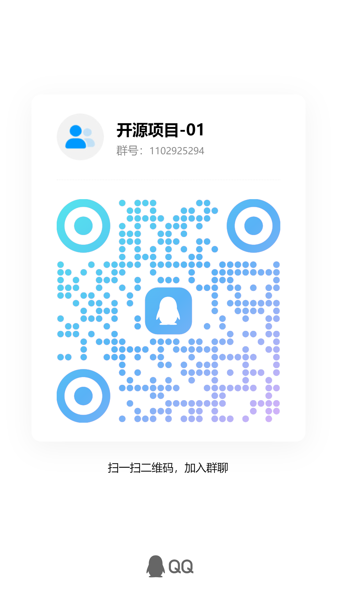

Prefer GitHub? Open an [issue](../../issues) or start a
[discussion](../../discussions).

## Privacy

Lumo is designed for children. It does **not** collect data and has no backend.
Conversation content never leaves the device except in the direct call to the
model provider you configure. See per-package notes for details.

## License

[MIT](./LICENSE)
